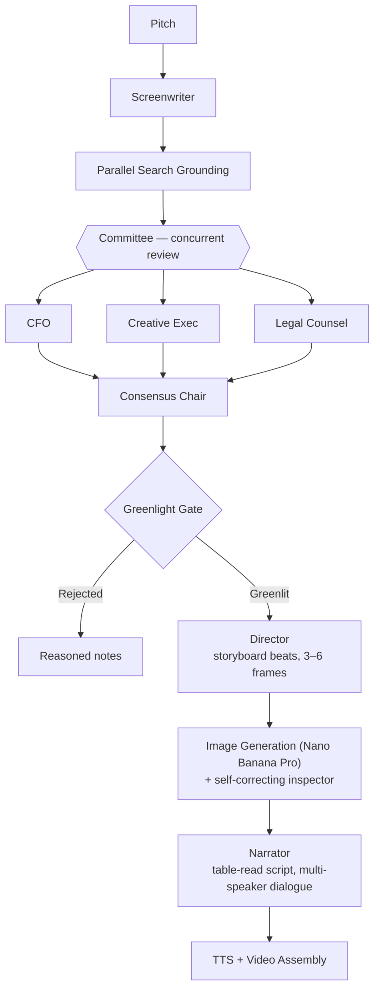

# StudioZ

**A multi-agent AI studio that pitches, negotiates, and previsualizes a film — before a single dollar of production budget is spent.**

Built for the [Agentic Cinema Hackathon](https://agentic-cinema.devpost.com) — Parallel Search partner track — on Google Cloud's Gemini Enterprise Agent Platform.

---

## What StudioZ Is

Every film starts as a pitch, and every pitch has to survive a room full of people who don't automatically agree with each other: a budget-conscious executive, a creative development lead chasing originality, and a legal counsel worried about clearance and ratings. That negotiation is where most ideas actually get shaped — and it's slow, expensive, and often invisible to the person who wrote the pitch in the first place.

StudioZ automates that room. Give it a one-line pitch, and it runs the idea through a full pre-production pipeline: a screenwriter agent drafts a treatment, that treatment is grounded in real market and legal data, a three-person executive committee debates it *concurrently* — each from a different, sometimes conflicting perspective — and a chair synthesizes their disagreement into one final, reasoned decision. If it's greenlit, a director agent storyboards it and generates concept art, then narrates the result into a short video.

**Who it's for:** not just traditional studios — solo creators, indie filmmakers, and small production teams who currently have no way to stress-test a pitch's financial, creative, and legal viability before committing real time or money to it. A modern "studio crew" is often one person wearing every hat; StudioZ gives that person a committee to argue with, for the cost of an API call instead of a table read.

---

## How It's Implemented

StudioZ runs entirely on Google's Gemini Enterprise Agent Platform (Vertex AI), using `google-genai` throughout, plus the Parallel Search API for real-world grounding.

**Pipeline:**



**Key components:**

- **Screenwriter** — drafts a structured treatment (title, genre, logline, synopsis, runtime) from a raw pitch. Multiple writer personas (blockbuster / indie) available.
- **Committee** — three specialist agents run concurrently, each grounded in real Parallel Search results relevant to their domain, each with a distinct persona, budget/rating framing scaled to the actual target runtime (a 3-minute short and a 90-minute feature are judged against different financial norms).
- **Consensus** — synthesizes the committee's often-conflicting reviews into one greenlight/reject decision with a real rationale, not a majority vote.
- **Director** — breaks an approved treatment into narrative beats (Setup → Climax → Resolution, scaled 3–6 frames by runtime) and writes per-frame visual prompts. Multiple visual personas, including a fully monochrome "explainer" style for architecture-walkthrough content.
- **Image generation** — `gemini-3-pro-image` (Nano Banana Pro), paired with a **self-correcting inspector**: every frame is reviewed against its own prompt and style constraints, and automatically regenerated with targeted feedback (not a blind retry) if it fails — up to a capped retry budget.
- **Narrator + TTS** — writes a hybrid "table read" script (third-person scene-setting plus in-character dialogue when 2+ characters are present in a frame), rendered with distinct Gemini TTS voices per character, gender-matched from real listening tests.
- **Video assembly** — ffmpeg-based compositing with disclaimer cards (target-runtime context, and an explicit notice if a rejected project's storyboard was force-generated for demo purposes) and audio/video sync.
- **Cost/latency ledger** — every model call is timed and cost-estimated, surfaced per run.

---

## How Parallel Is Used

Parallel's Search API is called directly via the official `parallel-web` SDK at three points in every committee review, one per specialist's domain:

| Committee member | Grounding query | Domain-restricted sources |
|---|---|---|
| CFO | Budget/box-office comparables | Box Office Mojo, The Numbers, Variety, Hollywood Reporter |
| Creative Exec | Market trends | Variety, Hollywood Reporter, Deadline |
| Legal Counsel | IP/rating precedent | Motion Picture Association, Wikipedia, IMDb |

Each search runs domain-restricted first, falling back to unrestricted search only if the trusted-domain pass doesn't return enough results — grounding stays sourced from credible outlets whenever possible. Results are injected as real context into each committee member's reasoning (not decoration — Arthur has cited real box-office figures for actual comparable films, Marcus has flagged real title-collision and rating precedent), and the underlying citations (title, URL, snippet) are surfaced directly in the UI, attributed to Parallel, so the grounding is visible and verifiable, not just claimed.

This integration uses the direct SDK path (one of three compliant integration patterns named in the hackathon rules) rather than Gemini's native Grounding tool, a deliberate choice made to keep grounding fully decoupled from the committee agents' strict `response_schema` structured output.

---

## For Judges

The fastest way to evaluate StudioZ without waiting on a live pipeline run (200–600+ seconds per full run):

1. Open the app and click **"Pipeline Architecture Explainer"** — a self-narrating, hands-off walkthrough of every agent in the pipeline, each speaking in first person in its own voice.
2. Click through to **"View Demo Result"** — a fully narrated walkthrough of one real, complete run: the executive consensus, how Parallel Search grounded the committee's reasoning, the verified storyboard, the cost/latency ledger, and the finished narrated video.

To run a live pitch yourself instead: submit any one-line pitch from the main page, optionally selecting a screenwriter/director persona pair and a target runtime. A run typically completes in 3–10 minutes depending on committee outcome and image retries.

---

## For Developers — Local Setup

### Prerequisites

- Python 3.12, [`uv`](https://docs.astral.sh/uv/) for dependency management
- Node.js (for the frontend)
- `ffmpeg` on your `PATH`
- A Google Cloud project with the **Vertex AI API** and **Discovery Engine API** enabled, and a service account with the `Vertex AI User` role
- A [Parallel](https://parallel.ai) API key

### Backend

```bash
git clone <repo-url>
cd studioz
uv sync

# Set environment variables (do NOT put these in a pydantic-settings .env
# file read by the app — GOOGLE_APPLICATION_CREDENTIALS should be a plain
# shell/OS environment variable):
export GOOGLE_APPLICATION_CREDENTIALS=/path/to/your-service-account.json
export GOOGLE_CLOUD_PROJECT=your-gcp-project-id
export GOOGLE_CLOUD_LOCATION=us-central1
export PARALLEL_API_KEY=your-parallel-api-key

uv run uvicorn studioz.api.main:app --reload
```

API docs available at `http://localhost:8000/docs`.

### Frontend

```bash
cd frontend
npm install
npm run dev
```

### One-time demo asset generation (optional, for the self-narrating explainer/demo views)

```bash
uv run python -m studioz.generate_demo_audio
```

---